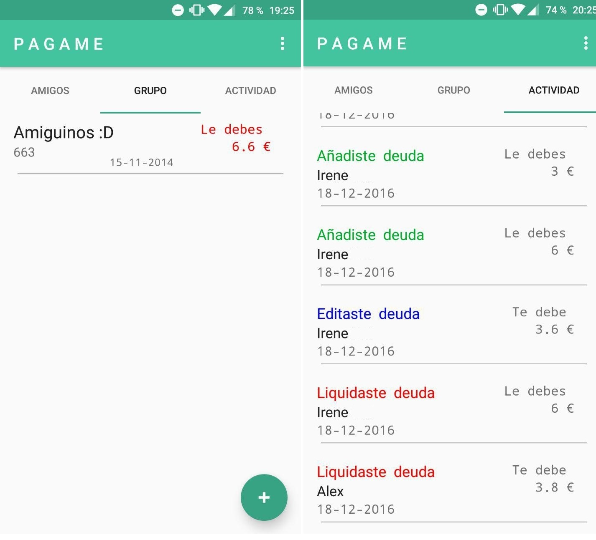

# Aplicación

A continuación, se detalla el diseño de la aplicación.
La pantalla inicial de la aplicación está compuesta por un botón de inicio de sesión a través de google.

Una vez hemos iniciado sesión o nos hemos registrado, tendremos acceso al menú principal, el cual tendrá a simple vista un apartado en el que veremos el saldo que disponemos (según las deudas que tengamos) y un listado con las diferentes “cuentas” que tenemos.

Nos aparecerá un menú en la parte de arriba de la aplicación con las diferentes “vistas” de las deudas que podemos tener.
En la primera tendremos un listado de deudas individuales (en las que solamente están implicadas dos personas, el usuario y un usuario secundario). En la segunda opción, llamada Grupos, tendremos un listado de deudas grupales, es decir, deudas en las que no están implicadas dos personas, si no, un grupo de ellas. Por último, tendremos una opción llamada “movimientos”, en esta opción será como un histórico de acciones que hemos hecho. Por ejemplo, en esta vista tendremos las deudas que ya hemos pagado, las que tenemos activas todavía…

Si pulsamos en el botón redondo de "Add",podremos crear una cuenta individual (si pulsamos el Add en la pestaña "Individual") o una cuenta en grupo (si pulsamos dicho botón en la pestaña "Grupo").

Para finalizar, si pulsamos sobre cualquier cuenta, nos aparecerá un detalle de la misma y también las opciones de "Liquidar" o "Añadir" un contacto en caso de que sea grupal.

Pulsando en los tres círculos blancos que aparecen en cualquiera de las tres pantallas principales de la que consta la aplicación, tendremos la opción de cerrar sesión de la aplicación.

## Autor

Judit Jiménez Jiménez