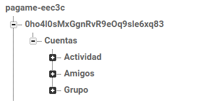
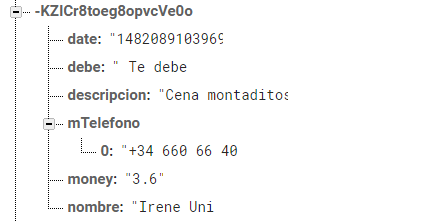

###Autor: Judit Jiménez Jiménez

#Págame

Págame es una aplicación de gestión de cuentas pendientes entre individuos. La aplicación permite a los usuarios añadir una deuda, para ello tendrán que introducir el nombre al que debe, el número de la otra persona implicada en la misma, una breve descripción, la cantidad de dinero correspondiente y si es una deuda que debe o que le deben. Para añadir el número del contacto, permitirá la búsqueda del número y nombre de los contactos de su agenda. Las deudas también podrán ser editadas y borradas. Se ofrece un listado de cuentas y también una vista más detallada de las mismas.
Permite asociar una deuda a varias personas, es decir, que esa deuda esté bajo un mismo tema, como, por ejemplo: hacer un grupo “Compañeros de piso” y asociar a ese grupo los compañeros de piso que tengamos. En este grupo se reflejarán las cuentas
que tengan que ver con el piso.
Además, Págame también ofrece de un solo vistazo un breve resumen del total de dinero del que se dispone teniendo en cuenta las cuentas que “restan” (aquellas a las que debemos) y las que “suman” (aquellas que nos deben).

##Requisitos del dispositivo
Para ejecutar el proyecto, el dispositivo debe cumplir el siquiente requisito:

* Android versión mínima 19 hasta la 25 de SDK.

##Estructura básica del proyecto

##Arquitectura de la aplicación

###Capa Presentación
En el Front de la aplicación usaremos Material Desing, intentando seguir las guías de estilo oficiales de Google. En esta clase predominarán las Activities y los Fragments, ambos se pueden ver en la sección del Mockup de la documentación. 

###Capa de negocio

Esta capa va a contener el código relacionado con la lógica de negocio de mi aplicación. El código de esta capa se encuentra dividido conceptualmente en dos secciones diferenciadas como:

* Gestión de usuarios: iniciar sesión como un usuario, obtener la foto y datos del perfil de Google. Esta gestión usa como “ayudante” la opción de Firebase de Autentificación de Google, por lo tanto, nos respaldamos en ella para todo lo relacionado con la gestión de usuarios.

* Gestión Deudas: creación, borrado, modificación y listado de deudas. Tendrá el control de lo que se deben los usuarios entre ellos, de los cálculos necesarios, de gestionar nuevas deudas. Al añadir y editar una deuda tendremos que acceder a los contactos de nuestra agenda, por lo tanto, necesitamos hacer uso de una clase que nos ayude con esto, esta clase es la llamada ChoosePhoneActivity. También podremos añadir a más de una persona a una deuda creada.

###Capa de datos
La última capa es la que se va a encargar de la persistencia de los datos relacionados con la aplicación y de interactuar con servicios externos. 
Teniendo en cuenta que nuestra aplicación se va a encargar de gestionar usuarios y deudas, necesitaremos una parte del sistema que se encargue de almacenar la información con la que estamos trabajando. 
Para almacenar esta información, se usa Firebase, ya que además de gestionar la base de datos se va a encargar de darnos multitud de servicios útiles, como la autentificación de los usuarios.
En esta capa también tenemos una parte del sistema encargada de acceder a datos del sistema, en concreto, a los números de teléfono del usuario.

###Estructura en AndroidStudio
En cuanto a la estructura básica del proyecto nos encontramos con diferentes clases y layout. Cada una de ellas se encuentra separada por paquetes en referencia a una agrupación de lo que son.

 

En el paquete Activity, encontraremos las diferentes Actividades de la aplicación.

* AddBillActivity: Esta activity será la encargada de recoger los datos del formulario del layout “activity_add_cuenta.xml” y almacenarlo en la Base de datos correspondiente.
* ChoosePhoneActivity: Esta actividad es nuestro contact provider. Se ha creado con una estructura muy parecida a la usada en clase de prácticas. Esta activity está relacionada con list.xml.
* DashboardActivity, esta será nuestra actividad principal, desde ella se crea el TabHost. Está relacionada con “activity_dashboard.xml” y con “activity_dashboard_content”. Estos layout serán una simple RecyclerView en la que inflaremos los Fragment correspondientes.
* DetailsBillActivity. Esta actividad es la encargada de recoger los datos de una cuenta en Actividad y Amigos de la Base de datos y mostrarla en los respectivos TabHost. Se relaciona con “activity_details_cuenta.xml”
* DetailsGroupActivity. Esta actividad es la encargada de recoger los datos de la base de datos del apartado Grupo y mostrarlos en el tab correspondiente. Relacionada con” activity_grupo_details” y con “list.xml” y con “activity_telefono_item”.
* EditBillActivity. Será la encargada de recoger los datos del formulario “activity_edit_cuenta.xml” y modificarla en la base de datos que corresponda.
* LoginActivity. Actividad desde la cual se gestiona el Login de la apliación, relacionada con “activity_login.xml”.

En el paquete "Fragment" encontraremos los diferentes Fragments de los que consta la aplicación:
* FragmentActivity. Este Fragment se encargará de mostrar la información correspondiente a la lista de actividades que tenemos en nuestra base de datos, Está relacionado con “fragment_content_actividad.xml”, con “activity_cuenta_item”.
* FragmentFriends. Este Fragment, al igual que el anterior, se encargará de mostrar la información correspondiente a la lista de “Amigos” de nuestra base de datos. Está relacionado con “Fragment_content_amigos.xml” y con “activity_cuenta_item”.
* FragmentGroup. Este Fragment, al igual que el anterior, se encargará de mostrar la información correspondiente a la lista de “Grupo” de nuestra base de datos. Está relacionado con “Fragment_content_gr.xml” y con “activity_cuenta_item”.

En el paquete Item encontraremos la clase POJO que usa toda la aplicación:
* BillItem. Esta clase es un POJO del objeto con su mismo nombre.

En el paquete Mensaje, veremos la clase que tiene que ver con Firebase
* NotificacionFirebase. Esta clase implementa un cliente de notificaciones que se pueden enviar desde Firebase para mostrar a los usuarios diferente información que quiera el gestor de la base de datos.

###Estructura en Firebase
La base de datos del proyecto es Firebase, la estructura que sigue en esta herramienta es la siguiente:

Tendremos un id único correspondiente al id único de cada usuario y asociado a este usuario tendremos Cuentas, que son de tres tipos “Actividad”, “amigos” y “grupo”.

Dentro de cada tipo, tendremos a su vez, cada cuenta detallada con un id único y los datos asociados a esa cuenta.

##Instalación
Para poder ejecutar la aplicación, abriremos AndroidStudio e instalaremos los pluggins necesarios. Una vez los tengamos todos instalados, ejecutaremos como un proyecto Android normal.

##Diseño de la aplicación
En el archivo ==Diseño.md== que se encuentra en esta carpeta, se encuentra cómo es la aplicación en cuestión.
En este archivo, además de enseñar la App, se explica qué hace cada pantalla y las opciones que hay en ellas.

#Lincencia
Este proyecto ha sido creado por Judit Jiménez.

Reconocimiento-NoComercial-SinObraDerivada 4.0 Internacional

